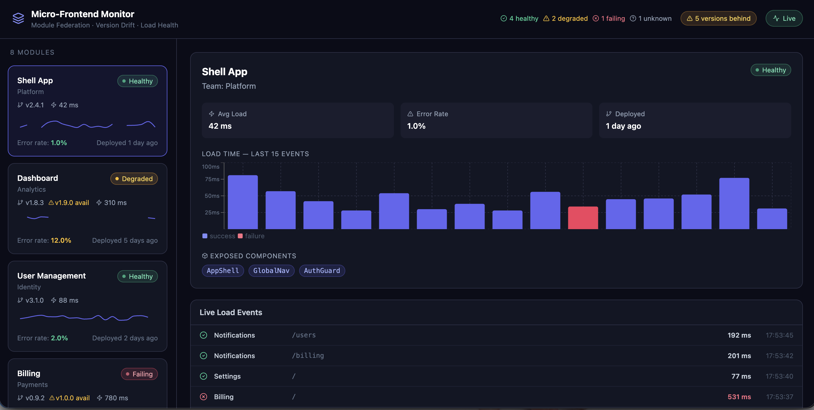

# Micro-Frontend Monitor

A real-time dashboard for monitoring **Module Federation micro-frontends** — version drift detection, load latency tracking, error rates, and live event feed.

  



## The problem this solves

Teams running 10+ federated modules with Module Federation have no central visibility into:
- Which modules are running **stale versions** (version drift)
- Which are experiencing **high error rates or slow loads**
- **Who consumes what** — the dependency graph across teams
- **Live load events** as users navigate across micro-frontends

This monitor gives you a Datadog-style dashboard, purpose-built for micro-frontend architectures.

## Features

- **Module health grid** — status badges (Healthy / Degraded / Failing / Unknown) with live pulse indicators
- **Version drift alerts** — highlights any module not running its latest published version
- **Load time sparklines** — per-module mini-chart of the last 20 load events
- **Module detail panel** — load time bar chart (success vs failure coloured), exposed components, consumers
- **Live event feed** — real-time stream of load events across all modules with success/failure indicators
- **Header summary** — at-a-glance counts of healthy / degraded / failing / unknown modules

## Tech stack

- **React 18** + **TypeScript**
- **Vite 5** for fast dev & builds
- **Tailwind CSS** for styling
- **Recharts** for charts and sparklines
- **date-fns** for human-readable timestamps
- **Lucide React** for icons

## Getting started

```bash
npm install
npm run dev
```

Open [http://localhost:5173](http://localhost:5173).

## Architecture

```
src/
├── components/
│   ├── ModuleCard.tsx      # Summary card with sparkline
│   ├── ModuleDetail.tsx    # Full detail panel
│   ├── MiniSparkline.tsx   # Inline load-time chart
│   ├── StatusBadge.tsx     # Health status indicator
│   └── EventFeed.tsx       # Live load event log
├── lib/
│   └── mock-data.ts        # Simulated module registry + events
├── types/
│   └── index.ts            # TypeScript interfaces
└── App.tsx                 # Main layout
```

## Connecting to a real Module Federation setup

Replace the mock data in `src/lib/mock-data.ts` with a real data source:
- Poll your module registry endpoint for version metadata
- Forward `__webpack_require__.l` load events to a collector endpoint
- Stream events via WebSocket into the `EventFeed` component

## Roadmap

- [ ] Real Module Federation integration via webpack plugin
- [ ] Slack / PagerDuty alerts on error rate threshold breach
- [ ] Dependency graph visualisation (which MFE depends on which)
- [ ] CI/CD integration — flag version drift in PRs automatically
- [ ] Historical SLA reporting per module

## Author

**Vikash Kumar** — [github.com/vikashkr05](https://github.com/vikashkr05) · [linkedin.com/in/vikashkumar108](https://linkedin.com/in/vikashkumar108)
